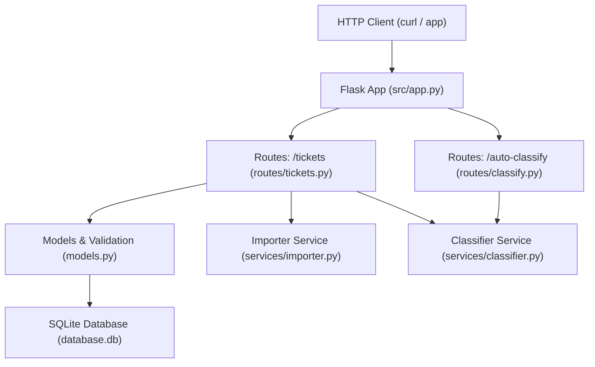

# 🎧 Homework 2: Intelligent Customer Support System

> **Tech Stack**: Python 3 · Flask · SQLite  
> **AI Tools Used**: GitHub Copilot  
> **Test Coverage**: 94% (69 tests)
> **Student Name:** Volodymyr Zubchynskyi 
> **Date Submitted:** May 14, 2026

---

## 📋 Project Overview

A REST API for managing customer support tickets. Key features:

- **Full CRUD** — create, read, update, delete tickets with field validation
- **Multi-format bulk import** — CSV, JSON, XML via `POST /tickets/import`
- **Auto-classification** — keyword-rule engine assigns category + priority with confidence score
- **Filtering** — `GET /tickets?status=new&category=billing_question&priority=high`
- **SQLite persistence** — zero-config, WAL mode for concurrent access
- **94% test coverage** — 69 tests across 8 test files

---

## Architecture



---

## Project Structure

```
homework-2/
├── src/
│   ├── app.py                  # Flask factory + SQLite init
│   ├── models.py               # Validation + raw SQL CRUD
│   ├── routes/
│   │   ├── tickets.py          # CRUD + import endpoints
│   │   └── classify.py         # Auto-classify endpoint
│   └── services/
│       ├── importer.py         # CSV / JSON / XML parsers
│       └── classifier.py       # Keyword-rule engine + logging
├── tests/
│   ├── conftest.py             # Shared pytest fixtures (fresh DB per test)
│   ├── fixtures/               # sample_tickets.{csv,json,xml} + invalid files
│   ├── test_ticket_api.py      # 18 API endpoint tests
│   ├── test_ticket_model.py    # 14 validation tests
│   ├── test_import_csv.py      # 6 CSV parser tests
│   ├── test_import_json.py     # 7 JSON parser tests
│   ├── test_import_xml.py      # 5 XML parser tests
│   ├── test_categorization.py  # 10 classifier tests
│   ├── test_integration.py     # 5 end-to-end tests
│   └── test_performance.py     # 5 benchmark tests
├── docs/
│   ├── README.md               # Full developer README
│   ├── API_REFERENCE.md        # All endpoints with cURL examples
│   ├── ARCHITECTURE.md         # Mermaid diagrams + design decisions
│   └── TESTING_GUIDE.md        # Test pyramid, how-to-run, benchmarks
├── generate_fixtures.py        # Generates all fixture files
└── pytest.ini
```

---

## Installation & Setup

```bash
cd homework-2

# Create virtual environment
python3 -m venv .venv
source .venv/bin/activate

# Install dependencies
pip install flask pytest pytest-cov

# Generate test fixtures
python generate_fixtures.py

# Run the server
python src/app.py
# → http://127.0.0.1:5000
```

---

## Running Tests

```bash
# All tests
pytest tests/

# With coverage
pytest tests/ --cov=src --cov-report=term-missing

# HTML coverage report
pytest tests/ --cov=src --cov-report=html:docs/coverage_html
# open docs/coverage_html/index.html
```

---

## Quick Start

```bash
# Create a ticket
curl -X POST http://localhost:5000/tickets \
  -H "Content-Type: application/json" \
  -d '{
    "customer_id": "CUST-001",
    "customer_email": "alice@example.com",
    "customer_name": "Alice",
    "subject": "Cannot login to my account",
    "description": "I cannot login since yesterday. Error says invalid credentials."
  }'

# Auto-classify it
curl -X POST http://localhost:5000/tickets/<id>/auto-classify

# Bulk import
curl -X POST http://localhost:5000/tickets/import \
  -F "file=@tests/fixtures/sample_tickets.csv"
```

---

## Documentation

| File | Audience | Contents |
|------|----------|----------|
| [`docs/README.md`](docs/README.md) | Developers | Full setup, architecture, project structure |
| [`docs/API_REFERENCE.md`](docs/API_REFERENCE.md) | API consumers | All endpoints, schemas, cURL examples |
| [`docs/ARCHITECTURE.md`](docs/ARCHITECTURE.md) | Tech leads | Mermaid diagrams, design decisions, security |
| [`docs/TESTING_GUIDE.md`](docs/TESTING_GUIDE.md) | QA engineers | Test pyramid, how-to-run, benchmarks, checklist |

<div align="center">

*This project was completed as part of the AI-Assisted Development course.*

</div>
