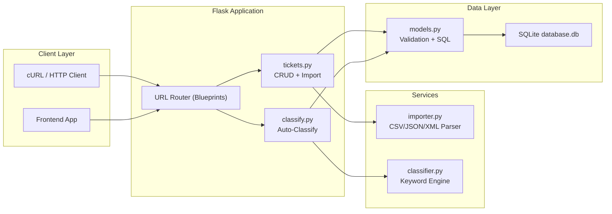
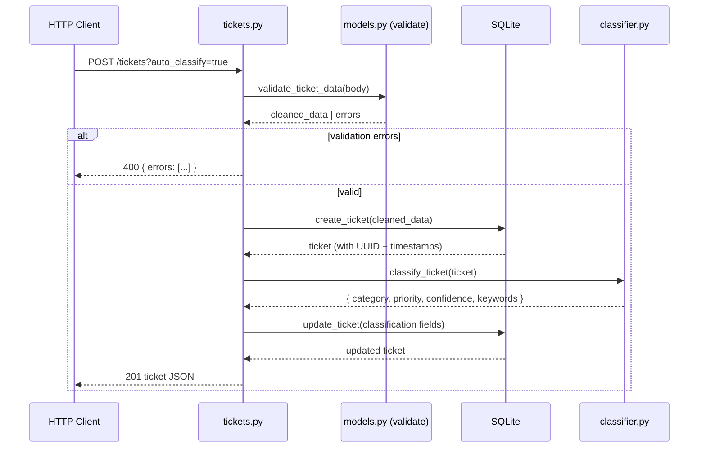
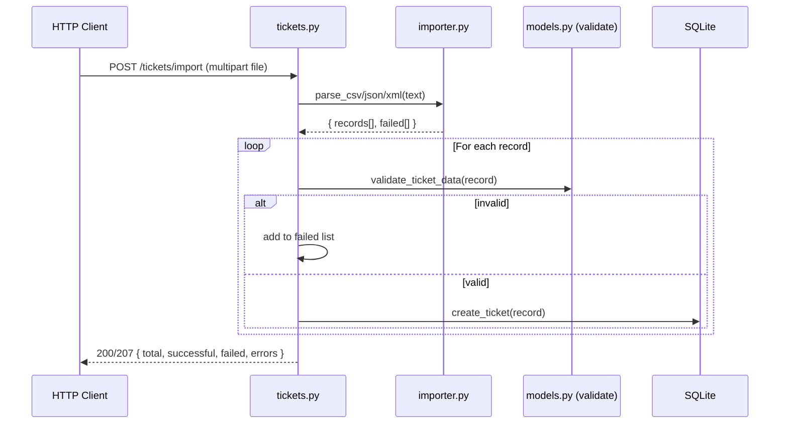

# Architecture

This document describes the architectural decisions and structure of the ticket management system. The application is built as a lightweight Flask REST API backed by SQLite, intentionally avoiding heavy frameworks to keep the codebase transparent and easy to reason about. The layered design (routes → services → models → database) enforces a clear separation of concerns: route handlers deal only with HTTP concerns, service modules encapsulate business logic (parsing and classification), and `models.py` owns data validation and persistence. This makes it straightforward to swap any layer independently — for example, replacing SQLite with PostgreSQL or the keyword classifier with an ML model — without touching the rest of the system.

## High-Level Architecture

---

## Component Descriptions

| Component | File | Responsibility |
|-----------|------|---------------|
| **App Factory** | `src/app.py` | Creates Flask app, registers blueprints, initializes SQLite schema |
| **Models** | `src/models.py` | Field validation (email, enums, lengths), raw SQL CRUD helpers, UUID generation |
| **Ticket Routes** | `src/routes/tickets.py` | 6 CRUD endpoints + `POST /tickets/import` |
| **Classify Route** | `src/routes/classify.py` | `POST /tickets/:id/auto-classify` |
| **Importer** | `src/services/importer.py` | Stateless parsers for CSV (`csv`), JSON (`json`), XML (`xml.etree.ElementTree`) |
| **Classifier** | `src/services/classifier.py` | Keyword dictionaries for priority/category scoring, confidence calculation, decision logging |

---

## Data Flow: Create Ticket with Auto-Classify

---

## Data Flow: Bulk Import

---

## Design Decisions

| Decision | Choice | Rationale |
|----------|--------|-----------|
| **ORM vs raw SQL** | Raw `sqlite3` | Zero dependencies, transparent queries, easy to understand |
| **Validation** | Custom helpers in `models.py` | No Pydantic/Marshmallow dependency; straightforward dict-in → dict-out |
| **Classification** | Keyword rules | Fully offline, deterministic, fast, easy to extend |
| **Confidence score** | `matched / total * 10` capped at 1.0 | Simple heuristic; weights keyword breadth over exact match count |
| **Storage** | SQLite WAL mode | Supports concurrent reads, safe writes, no server needed |
| **Blueprints** | Two separate blueprints | Separation of concerns; classify logic is a distinct domain |

---

## Security Considerations

- **No authentication** — add JWT/API-key middleware before production
- **SQL injection** — all queries use parameterized `?` placeholders
- **File upload** — content decoded as UTF-8; malformed files return 400 not 500
- **Input validation** — email regex, enum allow-lists, string length limits

## Performance Considerations

- SQLite WAL mode for concurrent read/write
- Single connection per request (no connection pool needed at this scale)
- Classifier is pure in-memory keyword scanning — sub-millisecond per ticket
- Bulk import processes records in a single transaction loop

