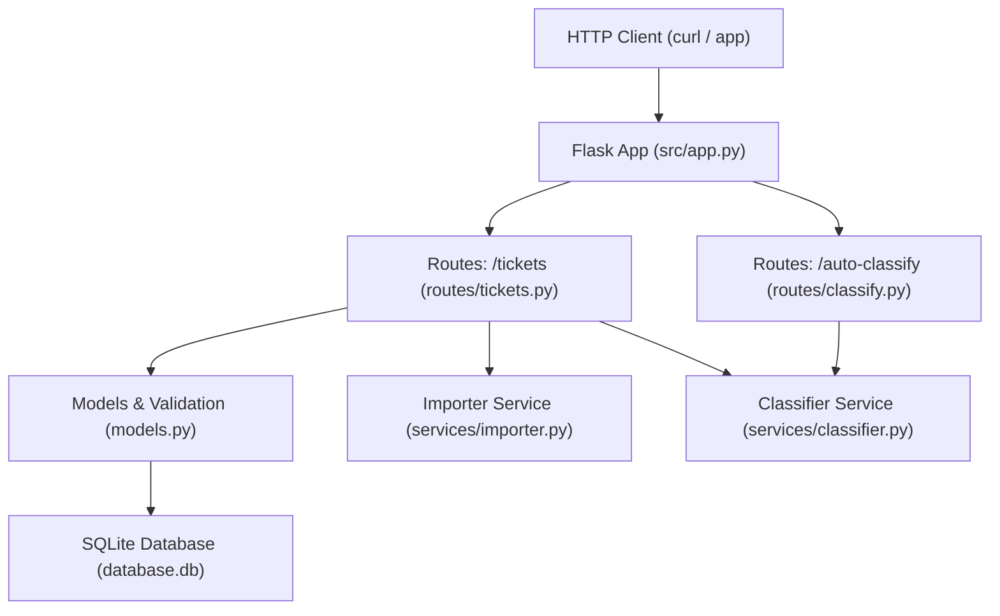

# 🎧 Customer Support Ticket System

A REST API for managing customer support tickets — built with **Python + Flask + SQLite**.  
Supports multi-format bulk import (CSV / JSON / XML), keyword-rule auto-classification, and full CRUD.

---

## Features

- ✅ Full CRUD for support tickets with validation
- ✅ Bulk import from CSV, JSON, and XML
- ✅ Keyword-rule based auto-classification (category + priority)
- ✅ Ticket filtering by `status`, `category`, `priority`
- ✅ SQLite persistence (zero setup)
- ✅ 94% test coverage (69 tests)

---

## Architecture



---

## Project Structure

```
homework-2/
├── src/
│   ├── app.py                  # Flask factory + DB init
│   ├── models.py               # Validation + raw SQL CRUD
│   ├── routes/
│   │   ├── tickets.py          # CRUD + import endpoints
│   │   └── classify.py         # Auto-classify endpoint
│   └── services/
│       ├── importer.py         # CSV / JSON / XML parsers
│       └── classifier.py       # Keyword-rule engine
├── tests/
│   ├── conftest.py             # Shared pytest fixtures
│   ├── fixtures/               # Sample data files
│   ├── test_ticket_api.py      # 11 API tests
│   ├── test_ticket_model.py    # 9 validation tests
│   ├── test_import_csv.py      # 6 CSV tests
│   ├── test_import_json.py     # 5 JSON tests
│   ├── test_import_xml.py      # 5 XML tests
│   ├── test_categorization.py  # 10 classifier tests
│   ├── test_integration.py     # 5 end-to-end tests
│   └── test_performance.py     # 5 benchmark tests
├── docs/
│   ├── API_REFERENCE.md
│   ├── ARCHITECTURE.md
│   └── TESTING_GUIDE.md
├── pytest.ini
└── generate_fixtures.py
```

---

## Installation & Setup

**Requirements:** Python 3.10+

```bash
# Clone / navigate to the project
cd homework-2

# Create and activate virtual environment
python3 -m venv venv
source venv/bin/activate          # macOS/Linux
# venv\Scripts\activate           # Windows

# Install dependencies
pip install flask pytest pytest-cov

# Run the server
python3 src/app.py
# → http://127.0.0.1:5000
```

---

## Running Tests

```bash
# All tests
pytest tests/

# With coverage report
pytest tests/ --cov=src --cov-report=term-missing

# HTML coverage report
pytest tests/ --cov=src --cov-report=html:docs/coverage_html
# Open docs/coverage_html/index.html
```

---

## Quick Start

```bash
# Create a ticket
curl -X POST http://localhost:5000/tickets \
  -H "Content-Type: application/json" \
  -d '{
    "customer_id": "CUST-001",
    "customer_email": "alice@example.com",
    "customer_name": "Alice",
    "subject": "Cannot login to my account",
    "description": "I cannot login since yesterday. Error says invalid credentials."
  }'

# Auto-classify it
curl -X POST http://localhost:5000/tickets/<id>/auto-classify

# Import tickets from CSV
curl -X POST http://localhost:5000/tickets/import \
  -F "file=@tests/fixtures/sample_tickets.csv"
```

