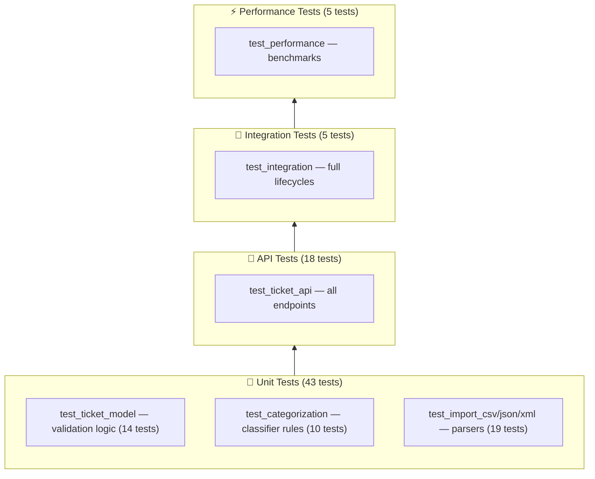

# Testing Guide

## Test Pyramid



---

## Running Tests

```bash
# Activate virtual environment first
source venv/bin/activate

# Run all tests
pytest tests/

# Run with verbose output
pytest tests/ -v

# Run a specific file
pytest tests/test_ticket_api.py -v

# Run a single test
pytest tests/test_categorization.py::test_urgent_priority_critical -v

# Run with coverage
pytest tests/ --cov=src --cov-report=term-missing

# Generate HTML coverage report
pytest tests/ --cov=src --cov-report=html:docs/coverage_html
# → Open docs/coverage_html/index.html in a browser
```

---

## Test Files Overview

| File | Count | What it tests |
|------|-------|---------------|
| `test_ticket_api.py` | 18 | All 6 REST endpoints: create, read, list, update, delete, 404s, 400s, auto-classify flag, import errors |
| `test_ticket_model.py` | 14 | Email validation, field lengths, enum checks, metadata parsing, tags, partial update mode |
| `test_import_csv.py` | 6 | CSV parsing: valid file, field stripping, empty file, invalid data |
| `test_import_json.py` | 7 | JSON parsing: array/object format, nested metadata, invalid syntax, non-dict items, unknown format |
| `test_import_xml.py` | 5 | XML parsing: valid file, `<tags>` as list, invalid XML, single ticket |
| `test_categorization.py` | 10 | All priority levels, all categories, fallback to `other`, confidence/keywords |
| `test_integration.py` | 5 | Full lifecycle, CSV import, JSON import + classify, filtering, 20 concurrent |
| `test_performance.py` | 5 | Single create speed, bulk import speed, list speed, P95 concurrent, classify speed |

---

## Sample Test Data

| File | Format | Records | Notes |
|------|--------|---------|-------|
| `tests/fixtures/sample_tickets.csv` | CSV | 50 | All valid tickets, all categories/priorities covered |
| `tests/fixtures/sample_tickets.json` | JSON | 20 | `{tickets: [...]}` wrapper, nested `metadata` |
| `tests/fixtures/sample_tickets.xml` | XML | 30 | `<tickets><ticket>...</ticket></tickets>` format |
| `tests/fixtures/invalid_tickets.csv` | CSV | 2 | Missing fields, bad email |
| `tests/fixtures/invalid_tickets.json` | JSON | 1 | Bad email, missing required fields |
| `tests/fixtures/invalid_tickets.xml` | XML | — | Malformed (unclosed tag) |

---

## Manual Testing Checklist

### Ticket CRUD
- [ ] `POST /tickets` with all required fields → `201`
- [ ] `POST /tickets` missing `customer_email` → `400` with clear error
- [ ] `POST /tickets` with invalid email format → `400`
- [ ] `POST /tickets` with invalid `category` enum → `400`
- [ ] `GET /tickets` returns array
- [ ] `GET /tickets?status=new` returns only `new` tickets
- [ ] `GET /tickets?category=billing_question&priority=high` combined filter
- [ ] `GET /tickets/:id` with valid ID → `200`
- [ ] `GET /tickets/nonexistent` → `404`
- [ ] `PUT /tickets/:id` update `status` to `resolved` → `200`
- [ ] `DELETE /tickets/:id` → `204`
- [ ] `DELETE /tickets/:id` again → `404`

### Import
- [ ] `POST /tickets/import` with `sample_tickets.csv` → `200`, `successful: 50`
- [ ] `POST /tickets/import` with `sample_tickets.json` → `200`, `successful: 20`
- [ ] `POST /tickets/import` with `sample_tickets.xml` → `200`, `successful: 30`
- [ ] `POST /tickets/import` with `invalid_tickets.csv` → `207`, some failures
- [ ] `POST /tickets/import` with `invalid_tickets.xml` → `400` (malformed XML)
- [ ] `POST /tickets/import` with no file → `400`

### Auto-Classify
- [ ] `POST /tickets/:id/auto-classify` on a ticket mentioning "cannot login" → `account_access`
- [ ] `POST /tickets/:id/auto-classify` on "critical production down" → `urgent`
- [ ] `POST /tickets/:id/auto-classify` on "minor cosmetic suggestion" → `low` priority
- [ ] Response includes `confidence`, `reasoning`, `keywords_found`

---

## Performance Benchmarks

Measured on Apple M-series, Python 3.14, SQLite WAL mode:

| Operation | Expected | Hard Limit |
|-----------|----------|------------|
| Single ticket `POST` | < 10ms | 500ms |
| Bulk import 50 CSV tickets | < 100ms | 3000ms |
| `GET /tickets` (20 items) | < 10ms | 500ms |
| Auto-classify (keyword scan) | < 1ms | 500ms |
| P95 of 20 concurrent `POST` | < 50ms | 2000ms |

