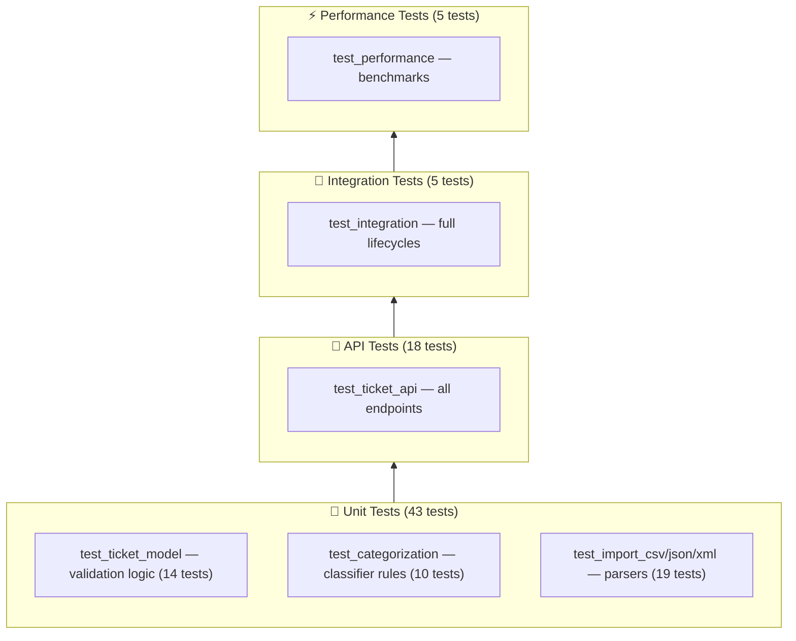

# Testing Guide

## Test Pyramid



---

## How Each Level Is Implemented

### 🔬 Unit Tests (43 tests)

Unit tests are the foundation of the pyramid. They test individual functions and classes in complete isolation — no HTTP server, no database, no external services.

#### `test_ticket_model.py` — Validation logic (14 tests)
- **What is tested:** The pure `validate_ticket_data()` function imported directly from `src/models.py`.
- **How it works:** A `BASE` dict of minimal valid fields is defined at module level. Each test passes a variation of that dict (missing field, bad email, enum out of range, etc.) and asserts on the `(cleaned_data, errors)` tuple that is returned.
- **Isolation:** No Flask app, no database, no HTTP — just Python function calls.
- **Key techniques:**
  - Dict unpacking (`{**BASE, "field": bad_value}`) to produce one-off invalid payloads.
  - Inspecting the `errors` list for keyword substrings (`any("email" in e for e in errors)`).
  - `partial=True` mode tested separately to confirm required-field checks are skipped on updates.

#### `test_categorization.py` — Classifier rules (10 tests)
- **What is tested:** The `classify_ticket()` function imported directly from `src/services/classifier.py`.
- **How it works:** A thin `_ticket(subject, description)` helper builds a minimal ticket dict. Each test asserts that specific keyword combinations produce the expected `priority`, `category`, `confidence`, `keywords_found`, and `reasoning` fields.
- **Isolation:** No Flask app, no database — just the pure classifier logic.
- **Key techniques:**
  - Positive keyword tests (e.g. `"critical"` → `urgent`, `"login"` → `account_access`).
  - Fallback test: an unrecognised subject/description must return `category == "other"` and `priority == "medium"`.
  - A structural test that verifies `confidence` is in `[0.0, 1.0]`, `keywords_found` is a list, and `reasoning` is a non-empty string.

#### `test_import_csv/json/xml.py` — Parser tests (19 tests)
- **What is tested:** The importer helpers in `src/services/importer.py` (CSV, JSON, and XML parsers) called directly — no HTTP layer.
- **How it works:** Raw bytes / file-like objects or fixture file paths are fed straight into the parsing functions. Return values (list of ticket dicts + error list) are asserted.
- **Isolation:** No Flask app, no database.
- **Key techniques:**
  - Happy-path: a known fixture file (`sample_tickets.csv`, etc.) is read and the number of successfully parsed records is checked.
  - Edge cases: empty file, whitespace-padded fields, `<tags>` as a comma-separated child element, JSON in both array and `{tickets:[…]}` wrapper forms.
  - Error paths: malformed XML raises an error string, invalid rows are captured in the errors list without raising.

---

### 🔌 API Tests (18 tests)

API tests verify the Flask HTTP layer end-to-end but still run against an in-memory SQLite database — there is no real network involved.

#### `test_ticket_api.py` — All endpoints (18 tests)
- **How the app is started:** The `fresh_app` fixture (defined in `conftest.py`) calls `create_app(db_path=<temp file>, testing=True)` and yields a Flask test client. A brand-new temp SQLite file is created before each test and deleted afterwards, so tests never share state.
- **How requests are made:** Flask's built-in `test_client` sends `POST`/`GET`/`PUT`/`DELETE` calls in-process — no real TCP socket.
- **What is covered:**
  - `POST /tickets` happy path → 201, returned JSON contains `id`.
  - `POST /tickets` with missing fields / bad email / unknown category → 400 with `errors` key.
  - `GET /tickets` → 200, returns a JSON array.
  - `GET /tickets?priority=urgent` → 200, every item matches the filter.
  - `GET /tickets/:id` found → 200; not found → 404.
  - `PUT /tickets/:id` update → 200 with updated field; not found → 404; invalid enum → 400.
  - `DELETE /tickets/:id` → 204; second delete → 404.
  - `POST /tickets?auto_classify=true` → 201 with a valid `category` value.
  - `POST /tickets/import` no file → 400; unsupported extension → 400.
  - `POST /tickets/:id/auto-classify` unknown id → 404.

---

### 🔗 Integration Tests (5 tests)

Integration tests exercise multiple components together in realistic multi-step workflows, still using the Flask test client and a temporary SQLite file.

#### `test_integration.py` — Full lifecycles (5 tests)
- **Fixture strategy:** Most tests use `fresh_app` (isolated per-test DB); the concurrency test uses the session-scoped `app` to share a single database across threads.
- **What is covered:**
  - **Full lifecycle** (`test_full_ticket_lifecycle`): Create → Read → Update (`status`, `assigned_to`) → Auto-classify → Delete → verify 404. Every REST endpoint is exercised in sequence.
  - **CSV bulk import + list** (`test_bulk_import_csv_then_list`): Posts `sample_tickets.csv` (50 rows) via `multipart/form-data` and verifies that the same number of records appear in `GET /tickets`.
  - **JSON import + auto-classify** (`test_bulk_import_with_auto_classify`): Imports 20 JSON tickets then calls `/auto-classify` on the first three; checks that returned categories are valid enum values.
  - **Filter coherence** (`test_filtering_by_status_and_category`): Creates two tickets with distinct `status`/`category` values and checks that `?status=` and `?category=` query params return only matching records.
  - **Concurrent creation** (`test_concurrent_ticket_creation`): Spins up 20 threads, each with its own `test_client`, all posting simultaneously. Asserts zero exceptions and all 201 responses, validating that SQLite WAL mode handles concurrent writes correctly.

---

### ⚡ Performance Tests (5 tests)

Performance tests wrap API calls with `time.perf_counter()` and assert that elapsed time stays under defined hard limits.

#### `test_performance.py` — Benchmarks (5 tests)
- **How timing works:** `time.perf_counter()` is called immediately before and after each operation; the delta is compared against a threshold constant defined at module level (`SINGLE_CREATE_MAX = 0.5s`, `BULK_IMPORT_50_MAX = 3.0s`, etc.).
- **What is covered:**
  - **Single ticket creation** (`test_single_ticket_creation_speed`): One `POST /tickets` must complete in < 0.5 s.
  - **Bulk CSV import** (`test_bulk_import_50_csv_speed`): Importing all 50 rows from `sample_tickets.csv` must finish in < 3.0 s.
  - **List speed** (`test_list_tickets_speed`): Pre-populates 20 tickets, then asserts `GET /tickets` responds in < 0.5 s.
  - **P95 concurrency** (`test_p95_response_time_20_requests`): 20 threads each post one ticket concurrently; the 95th-percentile response time must stay below 2.0 s.
  - **Auto-classify speed** (`test_auto_classify_speed`): One `/auto-classify` call on an existing ticket must respond in < 0.5 s.
- **Why these matter:** They act as regression guards — if a future change accidentally introduces an N+1 query or a blocking operation, these tests catch it immediately.

---

## Running Tests

```bash
# Activate virtual environment first
source venv/bin/activate

# Run all tests
pytest tests/

# Run with verbose output
pytest tests/ -v

# Run a specific file
pytest tests/test_ticket_api.py -v

# Run a single test
pytest tests/test_categorization.py::test_urgent_priority_critical -v

# Run with coverage
pytest tests/ --cov=src --cov-report=term-missing

# Generate HTML coverage report
pytest tests/ --cov=src --cov-report=html:docs/coverage_html
# → Open docs/coverage_html/index.html in a browser
```

---

## Test Files Overview

| File | Count | What it tests |
|------|-------|---------------|
| `test_ticket_api.py` | 18 | All 6 REST endpoints: create, read, list, update, delete, 404s, 400s, auto-classify flag, import errors |
| `test_ticket_model.py` | 14 | Email validation, field lengths, enum checks, metadata parsing, tags, partial update mode |
| `test_import_csv.py` | 6 | CSV parsing: valid file, field stripping, empty file, invalid data |
| `test_import_json.py` | 7 | JSON parsing: array/object format, nested metadata, invalid syntax, non-dict items, unknown format |
| `test_import_xml.py` | 5 | XML parsing: valid file, `<tags>` as list, invalid XML, single ticket |
| `test_categorization.py` | 10 | All priority levels, all categories, fallback to `other`, confidence/keywords |
| `test_integration.py` | 5 | Full lifecycle, CSV import, JSON import + classify, filtering, 20 concurrent |
| `test_performance.py` | 5 | Single create speed, bulk import speed, list speed, P95 concurrent, classify speed |

---

## Sample Test Data

| File | Format | Records | Notes |
|------|--------|---------|-------|
| `tests/fixtures/sample_tickets.csv` | CSV | 50 | All valid tickets, all categories/priorities covered |
| `tests/fixtures/sample_tickets.json` | JSON | 20 | `{tickets: [...]}` wrapper, nested `metadata` |
| `tests/fixtures/sample_tickets.xml` | XML | 30 | `<tickets><ticket>...</ticket></tickets>` format |
| `tests/fixtures/invalid_tickets.csv` | CSV | 2 | Missing fields, bad email |
| `tests/fixtures/invalid_tickets.json` | JSON | 1 | Bad email, missing required fields |
| `tests/fixtures/invalid_tickets.xml` | XML | — | Malformed (unclosed tag) |

---

## Manual Testing Checklist

### Ticket CRUD
- [ ] `POST /tickets` with all required fields → `201`
- [ ] `POST /tickets` missing `customer_email` → `400` with clear error
- [ ] `POST /tickets` with invalid email format → `400`
- [ ] `POST /tickets` with invalid `category` enum → `400`
- [ ] `GET /tickets` returns array
- [ ] `GET /tickets?status=new` returns only `new` tickets
- [ ] `GET /tickets?category=billing_question&priority=high` combined filter
- [ ] `GET /tickets/:id` with valid ID → `200`
- [ ] `GET /tickets/nonexistent` → `404`
- [ ] `PUT /tickets/:id` update `status` to `resolved` → `200`
- [ ] `DELETE /tickets/:id` → `204`
- [ ] `DELETE /tickets/:id` again → `404`

### Import
- [ ] `POST /tickets/import` with `sample_tickets.csv` → `200`, `successful: 50`
- [ ] `POST /tickets/import` with `sample_tickets.json` → `200`, `successful: 20`
- [ ] `POST /tickets/import` with `sample_tickets.xml` → `200`, `successful: 30`
- [ ] `POST /tickets/import` with `invalid_tickets.csv` → `207`, some failures
- [ ] `POST /tickets/import` with `invalid_tickets.xml` → `400` (malformed XML)
- [ ] `POST /tickets/import` with no file → `400`

### Auto-Classify
- [ ] `POST /tickets/:id/auto-classify` on a ticket mentioning "cannot login" → `account_access`
- [ ] `POST /tickets/:id/auto-classify` on "critical production down" → `urgent`
- [ ] `POST /tickets/:id/auto-classify` on "minor cosmetic suggestion" → `low` priority
- [ ] Response includes `confidence`, `reasoning`, `keywords_found`

---

## Performance Benchmarks

Measured on Apple M-series, Python 3.14, SQLite WAL mode:

| Operation | Expected | Hard Limit |
|-----------|----------|------------|
| Single ticket `POST` | < 10ms | 500ms |
| Bulk import 50 CSV tickets | < 100ms | 3000ms |
| `GET /tickets` (20 items) | < 10ms | 500ms |
| Auto-classify (keyword scan) | < 1ms | 500ms |
| P95 of 20 concurrent `POST` | < 50ms | 2000ms |

