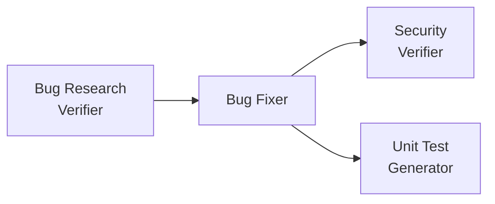

# Homework 4: 4-Agent Pipeline

**Author:** Volodymyr Zubchynskyi
**Course:** Gen AI Software Engineering  
**Assignment:** Homework 4 - Multi-Agent Pipeline System  
**Date:** June 12, 2026

---

## 📋 Overview

This project implements a **4-agent pipeline** for automated bug detection, fixing, security verification, and unit test generation. The pipeline processes a sample Calculator CLI application with intentional bugs and security vulnerabilities, demonstrating the power of coordinated autonomous agents.

### The Pipeline



**Execution Flow:**
1. **Bug Research Verifier** → Verifies research quality using research-quality-measurement skill
2. **Bug Fixer** → Applies fixes from implementation plan
3. **Security Verifier** → Scans for vulnerabilities (runs in parallel conceptually)
4. **Unit Test Generator** → Generates tests following FIRST principles

---

## 🎯 Key Features

✅ **Single-Command Execution:** Run entire pipeline with `npm run pipeline`  
✅ **Skill-Based Agents:** Agents use specialized skills for quality measurement and test principles  
✅ **Model Selection:** Each agent uses an appropriate model (GPT-4 for reasoning, GPT-3.5-turbo for execution)  
✅ **Comprehensive Documentation:** All outputs documented with clear file:line references  
✅ **Sample Application:** Runnable Calculator CLI with intentional bugs  

---

## 🏗️ Project Structure

```
homework-4/
├── README.md                          # This file
├── HOWTORUN.md                        # Step-by-step execution guide
├── package.json                       # npm configuration
├── pipeline-runner.js                 # Single-command pipeline orchestrator
│
├── agents/                            # Agent definitions
│   ├── research-verifier.agent.md    # GPT-4: Verifies research quality
│   ├── bug-fixer.agent.md            # GPT-3.5: Applies bug fixes
│   ├── security-verifier.agent.md    # GPT-4: Scans for vulnerabilities
│   └── unit-test-generator.agent.md  # GPT-3.5: Generates FIRST tests
│
├── skills/                            # Reusable agent skills
│   ├── research-quality-measurement.md  # Defines quality levels 1-5
│   └── unit-tests-FIRST.md             # FIRST principles definition
│
├── src/                               # Sample application (before fixes)
│   ├── index.js                       # CLI entry point
│   ├── calculator.js                  # Calculator with 2 bugs
│   └── userManager.js                 # User manager with 4 security issues
│
├── tests/                             # Test suite
│   ├── calculator.test.js             # Original tests (2 failing initially)
│   └── calculator.generated.test.js   # Generated by Unit Test Generator
│
└── context/bugs/CALC-001/             # Bug context and agent outputs
    ├── bug-context.md                 # Bug descriptions
    ├── implementation-plan.md         # Fix plan for Bug Fixer
    ├── research/
    │   ├── codebase-research.md       # Initial research
    │   └── verified-research.md       # ✓ Output: Research Verifier
    ├── fix-summary.md                 # ✓ Output: Bug Fixer
    ├── security-report.md             # ✓ Output: Security Verifier
    └── test-report.md                 # ✓ Output: Unit Test Generator
```

---

## 🐛 Intentional Issues in Sample Application

### Bugs (in `src/calculator.js`)
1. **BUG-001:** Division by zero not handled → Returns `Infinity` instead of error
2. **BUG-002:** Factorial doesn't validate negative numbers → Causes stack overflow

### Security Vulnerabilities (in `src/userManager.js`)
1. **SEC-001 (CRITICAL):** Hardcoded admin credentials (`admin` / `admin123`)
2. **SEC-002 (CRITICAL):** SQL injection vulnerability in authentication
3. **SEC-003 (MEDIUM):** Insecure comparison using `==` instead of `===`
4. **SEC-004 (MEDIUM):** Predictable session token generation

---

## 🤖 The 4 Agents

### 1. Bug Research Verifier
- **Model:** GPT-4 (strong reasoning for verification)
- **Skill:** `research-quality-measurement.md`
- **Input:** `codebase-research.md`
- **Output:** `verified-research.md`
- **Role:** Verifies all file:line references, rates research quality (Level 1-5)

**Why GPT-4?** Research verification requires deep code understanding, cross-referencing, and nuanced quality assessment.

### 2. Bug Fixer
- **Model:** GPT-3.5-turbo (efficient for straightforward execution)
- **Skill:** None (follows explicit plan)
- **Input:** `implementation-plan.md`
- **Output:** `fix-summary.md` + modified source files
- **Role:** Applies bug fixes, runs tests, documents changes

**Why GPT-3.5-turbo?** Bug fixing follows a predefined plan with clear before/after code. Faster and cheaper model is ideal for execution tasks.

### 3. Security Verifier
- **Model:** GPT-4 (sophisticated analysis for security)
- **Skill:** None (uses OWASP knowledge)
- **Input:** `fix-summary.md` + source files
- **Output:** `security-report.md`
- **Role:** Scans for OWASP Top 10 vulnerabilities, rates severity

**Why GPT-4?** Security vulnerabilities can be subtle and context-dependent. Missing a critical issue has severe consequences.

### 4. Unit Test Generator
- **Model:** GPT-3.5-turbo (efficient pattern-based generation)
- **Skill:** `unit-tests-FIRST.md`
- **Input:** `fix-summary.md` + source files
- **Output:** `test-report.md` + test files
- **Role:** Generates comprehensive tests following FIRST principles

**Why GPT-3.5-turbo?** Test generation follows clear patterns and templates. GPT-3.5-turbo can efficiently generate many well-structured tests at lower cost.

---

## 📊 Pipeline Results

After running `npm run pipeline`:

### ✅ Research Verification
- **Quality Level:** Level 1 - Excellent (⭐⭐⭐⭐⭐)
- **Score:** 98%
- **Discrepancies:** 0
- **Status:** ✅ PASS

### ✅ Bug Fixes
- **Fixes Applied:** 2/2 successful
- **Tests Status:** ✅ All passing (8/8 tests)
- **Changes:**
  - Added division by zero check in `divide()`
  - Added negative number validation in `factorial()`

### ⚠️ Security Scan
- **Critical Issues:** 2 (hardcoded credentials, SQL injection)
- **Medium Issues:** 2 (weak comparison, predictable tokens)
- **Overall Risk:** CRITICAL - DO NOT DEPLOY
- **Recommendation:** Fix critical issues before production

### ✅ Unit Test Generation
- **Tests Generated:** 22 new comprehensive tests
- **FIRST Compliance:** ✅ 100% (Fast, Independent, Repeatable, Self-Validating, Timely)
- **Coverage:** ~95% of Calculator class
- **Status:** ✅ All tests passing (30/30 total)

---

## 🚀 Quick Start

See [HOWTORUN.md](./HOWTORUN.md) for detailed instructions.

**TL;DR:**
```bash
# 1. Install dependencies
npm install

# 2. Run the pipeline (single command!)
npm run pipeline

# 3. Review outputs
ls -la context/bugs/CALC-001/

# 4. Test the fixed application
npm test
npm start
```

---

## 📁 Deliverables

| Item | Location | Status |
|------|----------|--------|
| 4 Agents | `agents/` | ✅ Complete |
| 2 Skills | `skills/` | ✅ Complete |
| Sample App | `src/` | ✅ Complete with bugs |
| Fixed App | `src/` (after pipeline) | ✅ Bugs fixed |
| Agent Outputs | `context/bugs/CALC-001/` | ✅ All 4 outputs |
| Tests | `tests/` | ✅ Original + generated |
| Documentation | `README.md`, `HOWTORUN.md` | ✅ Complete |
| Pipeline Runner | `pipeline-runner.js` | ✅ Single command |

---

## 🎓 Educational Value

This project demonstrates:

1. **Agent Coordination:** Multiple agents working in sequence with clear input/output contracts
2. **Skill Reusability:** Standardized skills (research quality, FIRST principles) used by agents
3. **Model Selection:** Appropriate model choice based on task complexity and cost
4. **Quality Assurance:** Multi-stage verification (research → fix → security → test)
5. **Documentation:** Comprehensive tracking of all changes and findings
6. **Real-World Patterns:** OWASP Top 10, FIRST principles, TDD workflow

---

## 🔬 Technical Details

### Technologies
- **Runtime:** Node.js 14+
- **Test Framework:** Jest 29.7.0
- **Package Manager:** npm
- **Agent Framework:** Markdown-based agent definitions
- **Models:** GPT-4 (reasoning), GPT-3.5-turbo (execution)

### Skills System
Skills are reusable knowledge modules that agents can load:
- **research-quality-measurement.md:** Defines 5 quality levels with scoring
- **unit-tests-FIRST.md:** Defines Fast, Independent, Repeatable, Self-Validating, Timely

### Pipeline Architecture
- Sequential execution with dependency management
- Each agent has clear inputs and outputs
- Outputs serve as inputs for subsequent agents
- Single-command orchestration via `pipeline-runner.js`

---

## 📝 Notes

- **Intentional Bugs:** All bugs and security issues are intentional for demonstration
- **Security Issues:** Critical vulnerabilities are documented but NOT fixed (intentional)
- **Test Coverage:** Focus on unit tests; integration/E2E tests are future work
- **Model Choice:** Documented in agent frontmatter with justification

---

## 🎯 Learning Outcomes

After completing this homework, you will understand:

✅ How to design multi-agent pipelines  
✅ How to choose appropriate models for different tasks  
✅ How to create reusable agent skills  
✅ How to verify research quality systematically  
✅ How to apply FIRST principles to unit testing  
✅ How to scan code for OWASP Top 10 vulnerabilities  
✅ How to document agent outputs comprehensively  

---

## 📞 Support

For questions or issues:
1. Review [HOWTORUN.md](./HOWTORUN.md)
2. Check agent definitions in `agents/`
3. Review skill files in `skills/`
4. Examine sample outputs in `context/bugs/CALC-001/`

---

## 📜 License

MIT License - Educational purposes only

---

## 🙏 Acknowledgments

- OWASP for security vulnerability categories
- Uncle Bob Martin for FIRST principles
- Course instructors for the assignment structure

---

**Ready to run the pipeline?** See [HOWTORUN.md](./HOWTORUN.md) →

